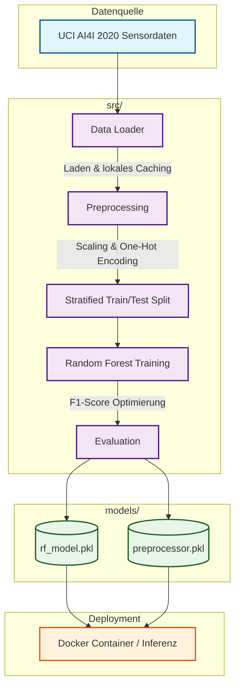

# Predictive Maintenance
In der modernen Industrie sind ungeplante Maschinenstillstände ein massiver Kostenfaktor. Dieses Projekt implementiert eine vollständige Machine-Learning-Pipeline für **Predictive Maintenance** (vorausschauende Instandhaltung), um Maschinenausfälle frühzeitig zu erkennen, bevor sie eintreten. Basierend auf realistischen Sensordaten des AI4I 2020 Datensatzes analysiert das System Temperatur, Drehzahl und Werkzeugverschleiß, um das Ausfallrisiko präzise vorherzusagen. Dabei liegt der Fokus auf der Bewältigung typischer Praxis-Herausforderungen wie extrem unbalancierter Daten und der strikten Vermeidung von Data Leakage. Die resultierende, reproduzierbare Pipeline mündet in einem einsatzbereiten Random-Forest-Modell, das nahtlos in bestehende Produktionssysteme integriert werden kann.

## Ziele

- Frühzeitig erkennen, ob eine Maschine ausfallen wird (`Machine failure`)
- Mit unbalancierten Klassen umgehen (`class_weight='balanced'`, stratifizierter Split)
- Reproduzierbare Pipeline mit Tests und optionaler Docker-Ausführung

## Architektur



## Projektstruktur

```
├── data/                    # Lokale CSV (wird beim ersten Lauf ggf. automatisch angelegt)
│   └── .gitkeep
├── src/
│   ├── data_loader.py       # Daten laden (lokal oder von UCI)
│   ├── preprocessing.py     # Feature Engineering & Scaling
│   ├── model.py             # Training, Evaluation, Speichern
│   └── main.py              # Orchestrierung der Pipeline
├── tests/
│   └── test_pipeline.py     # Unit Tests
├── models/                  # Gespeichertes Modell und Preprocessor
│   └── .gitkeep
├── Dockerfile
├── requirements.txt
└── README.md
```

## Voraussetzungen

- Python 3.9 oder höher (empfohlen)
- Internet beim **ersten** Lauf, falls `data/predictive_maintenance.csv` noch nicht existiert

## Installation

Im Projektroot:

```bash
python -m venv .venv
.venv\Scripts\activate          # Windows
# source .venv/bin/activate   # Linux/macOS

pip install -r requirements.txt
```

## Pipeline starten

Vom Projektroot aus (damit Imports wie `src.*` funktionieren):

```bash
python -m src.main
```

Ablauf:

1. **Daten laden** – aus `data/predictive_maintenance.csv` oder Download von UCI
2. **Preprocessing** – numerische Features skalieren, `Type` one-hot encodieren
3. **Training** – Random Forest mit balancierten Klassengewichten
4. **Evaluation** – Classification Report und **F1-Score** (Hauptmetrik bei seltenen Ausfällen)
5. **Speichern** – `models/rf_model.pkl` und `models/preprocessor.pkl`

## Tests

```bash
pytest tests/ -v
```

Die Tests prüfen unter anderem Datensatzform (10.000 Zeilen, Target-Spalte) und die Feature-Dimension nach dem Preprocessing. Beim ersten Testlauf kann ein Daten-Download stattfinden.

## Docker

```bash
docker build -t predictive-maintenance .
docker run predictive-maintenance
```

Der Container führt `python src/main.py` aus. Für persistente Daten und Modelle können Volumes auf `data/` und `models/` gemountet werden.

## Technologien

| Bereich        | Bibliothek        |
|----------------|-------------------|
| Daten          | pandas            |
| ML             | scikit-learn      |
| Serialisierung | joblib            |
| Tests          | pytest            |
| Linting        | flake8            |

## Hinweise

- Spalten `UDI` und `Product ID` werden beim Preprocessing entfernt.
- Der Preprocessor wird **nur auf Trainingsdaten** gefittet, um Data Leakage zu vermeiden.
- Große Artefakte in `data/` und `models/` sind per `.gitignore` ausgeschlossen; leere Ordner bleiben über `.gitkeep` im Repository.

## Lizenz & Daten

Der verwendete Datensatz stammt vom [UCI ML Repository](https://archive.ics.uci.edu/ml/datasets/ai4i+2020). Nutzungsbedingungen des Repositories beachten.
